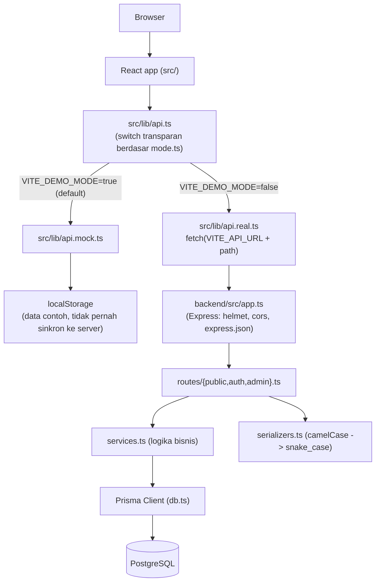
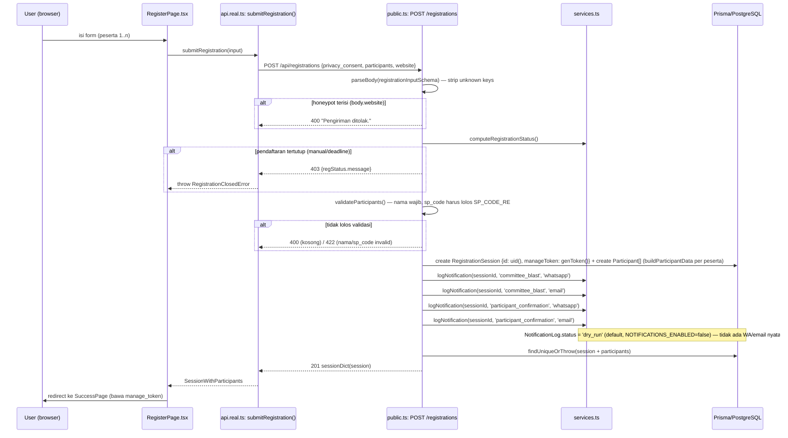
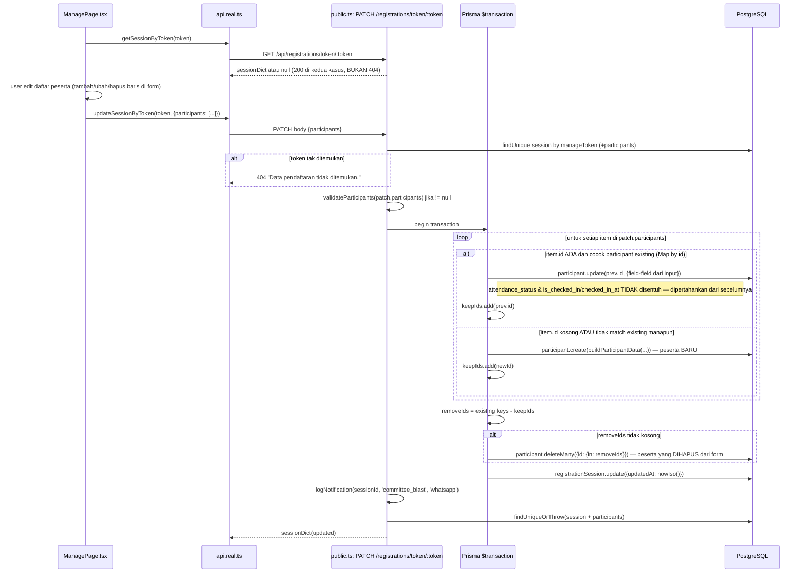
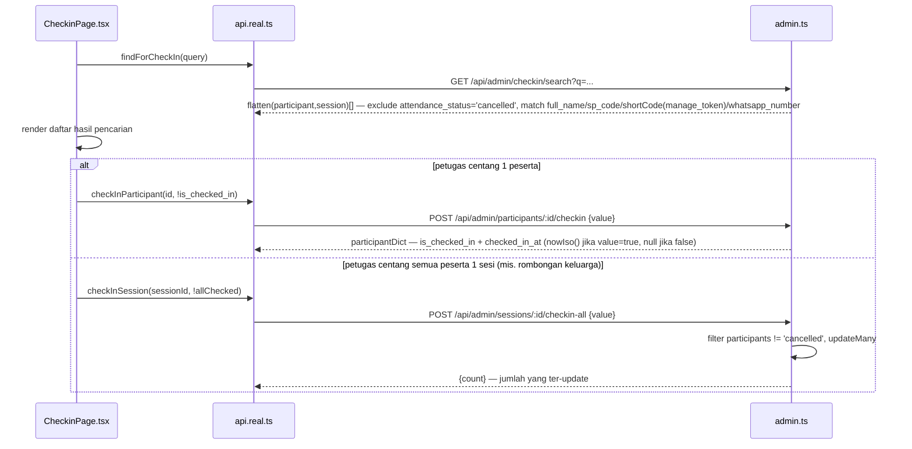
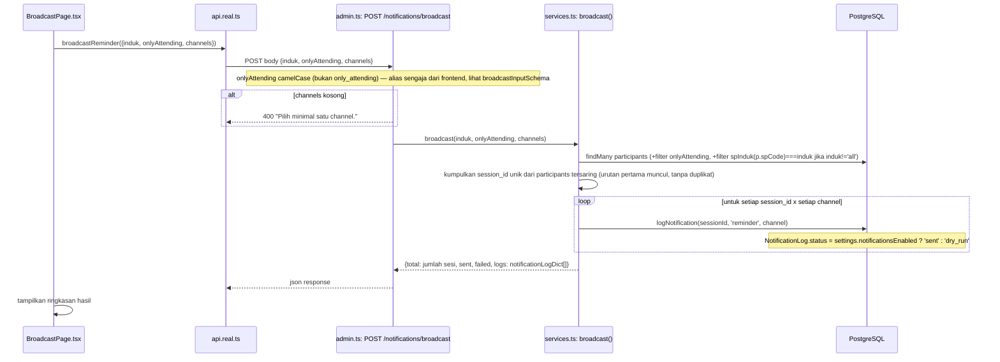

# Architecture — SP Portal

> **Untuk AI coding agent.** Peta struktural + 5 alur inti, diverifikasi dari
> kode (bukan reka-reka urutan). Untuk kontrak field per endpoint, lihat
> [API_REFERENCE.md](API_REFERENCE.md). Untuk istilah domain, lihat
> [GLOSSARY.md](GLOSSARY.md).

## Diagram tingkat tinggi



Komponen React **tidak boleh** mengimpor langsung dari `api.mock.ts` atau
`api.real.ts` — selalu lewat `src/lib/api.ts` (lihat CLAUDE.md).

## Alur inti

### a. Pendaftaran publik baru

Sumber: `src/pages/public/RegisterPage.tsx` → `submitRegistration()`
(`src/lib/api.real.ts`) → `POST /api/registrations`
(`backend/src/routes/public.ts`).



Catatan: keempat `logNotification` dipanggil **berurutan dan di-await**
(bukan fire-and-forget paralel) sebelum response dikirim — lihat
`public.ts` baris ~90-93.

### b. Kelola mandiri via token (ManagePage) — bagian paling kompleks di repo

Sumber: `src/pages/public/ManagePage.tsx` → `getSessionByToken()` /
`updateSessionByToken()` → `GET`/`PATCH /api/registrations/token/:token`
(`backend/src/routes/public.ts`).



**Logic diffing (persis, jangan disederhanakan saat membaca kode):** array
`participants` yang dikirim client adalah **representasi penuh** daftar akhir
yang diinginkan, bukan delta. Backend membangun `Map<id, existing>` dari data
lama, lalu untuk tiap item terima:
- **update in place** jika `item.id` cocok dengan participant yang sudah ada —
  field editable diperbarui, tapi `attendance_status`, `is_checked_in`,
  `checked_in_at` **tidak ikut diubah oleh endpoint ini** (hanya bisa diubah
  lewat endpoint admin `PATCH /api/admin/participants/:id` atau
  `POST .../status`, `.../checkin`).
- **create** jika `item.id` kosong/null atau tidak cocok existing manapun.
- **delete** untuk id lama yang **tidak muncul** di array yang dikirim —
  artinya menghilangkan sebuah baris dari form ManagePage = permintaan hapus
  peserta tersebut secara permanen.

Seluruh operasi dibungkus `prisma.$transaction` (`public.ts` PATCH handler)
supaya kegagalan di tengah loop tidak meninggalkan sesi separuh ter-update.

`POST /api/registrations/token/:token/cancel` **tidak** memakai logic
diffing ini — cukup `updateMany` semua participant di sesi jadi
`attendance_status: 'cancelled'`, sesi & peserta tetap ada di DB.

### c. Login admin + request terautentikasi

Sumber: `src/pages/admin/LoginPage.tsx` → `login()` (`api.real.ts`) →
`POST /api/auth/login` → `requireCommittee` middleware untuk request
selanjutnya.

```mermaid
sequenceDiagram
    participant LP as LoginPage.tsx
    participant API as api.real.ts
    participant AR as auth.ts: POST /login
    participant MW as middleware/auth.ts: requireCommittee
    participant DB as PostgreSQL

    LP->>API: login(email, password)
    API->>AR: POST /api/auth/login {email, password}
    Note over AR: dibatasi expres-rate-limit: 10x / 15 menit / IP, sukses tidak dihitung
    AR->>DB: committee.findFirst({email: trim().toLowerCase()})
    alt tidak ditemukan ATAU verifyPassword() gagal
        AR-->>API: 401 "Email atau kata sandi salah."
    else committee.isActive === false
        AR-->>API: 403 "Akun panitia ini telah dinonaktifkan."
    end
    AR->>AR: createAccessToken(committee.id, committee.role) — JWT HS256, exp 24h default
    AR-->>API: {token, committee: committeeDict}
    API->>API: localStorage.setItem('sp.session', {token, committee})
    LP->>LP: navigate('/admin')

    Note over API,MW: setiap request admin berikutnya
    API->>MW: fetch(...) + header Authorization: Bearer <token>
    MW->>MW: decodeAccessToken(token)
    alt token hilang/invalid/expired
        MW-->>API: 401
    end
    MW->>DB: committee.findUnique(payload.sub)
    alt tidak ditemukan
        MW-->>API: 401
    else isActive === false
        MW-->>API: 403
    end
    MW->>MW: req.committee = committee; next()
```

`requireSuperAdmin` (dipanggil setelah `requireCommittee` pada route
committees) hanya mengecek `req.committee.role === 'super_admin'`, tidak
query DB tambahan.

### d. Check-in hari-H

Sumber: `src/pages/admin/CheckinPage.tsx` → `findForCheckIn()` /
`checkInParticipant()` / `checkInSession()`.



### e. Broadcast notifikasi (log-only)

Sumber: `src/pages/admin/BroadcastPage.tsx` → `broadcastReminder()` →
`POST /api/admin/notifications/broadcast` → `services.broadcast()`.



`NOTIFICATIONS_ENABLED=false` adalah default (`backend/src/config.ts`) —
selama itu, **tidak ada** integrasi gateway WA/Email nyata di belakang flag
ini; `logNotification()` hanya menulis baris `notification_logs` dengan
status `dry_run`. Membalik flag ke `true` akan membuat status menjadi `sent`
tanpa benar-benar mengirim apa pun, karena belum ada kode pengiriman —
lihat komentar di `services.ts:logNotification()`.

## Where does X live

| Konsep bisnis | Frontend | Backend |
|---|---|---|
| Validasi format Kode SP (`SP_CODE_RE`) | `isValidSpCode()`, `normalizeSpCode()` — `src/lib/format.ts` | `isValidSpCode()`, `normalizeSpCode()` — `backend/src/utils.ts` |
| SP Induk (token pertama Kode SP) | `spInduk()` — `src/lib/format.ts` | `spInduk()` — `backend/src/utils.ts` |
| Pengurutan alami Kode SP | `compareSpCode()` — `src/lib/format.ts` | `compareSpCode()` — `backend/src/utils.ts` |
| Normalisasi nomor WhatsApp ke `62...` | `normalizeWhatsApp()` — `src/lib/format.ts` | `normalizeWhatsapp()` — `backend/src/utils.ts` |
| Kalkulasi umur dari `birth_date` | `calculateAge()` — `src/lib/format.ts` | `calculateAge()` — `backend/src/utils.ts` |
| **Masking WhatsApp untuk UI publik** | `maskWhatsApp()` — `src/lib/format.ts`, dipakai di `src/pages/public/ParticipantsPage.tsx` | — (backend mengirim nomor asli tanpa masking; masking murni tanggung jawab UI) |
| Guard produksi (tolak start dengan secret/password default) | — | `assertProductionSafe()` — `backend/src/config.ts` |
| CORS allowlist eksplisit | — | `corsOriginList` — `backend/src/config.ts`, dipakai di `app.ts` |
| Rate limit login | — | `loginLimiter` (`express-rate-limit`) — `backend/src/routes/auth.ts` |
| Mode data DEMO vs REAL | `src/lib/mode.ts` (`DEMO_MODE`, `API_BASE_URL`) | — |
| Serialisasi camelCase → snake_case | — | `backend/src/serializers.ts` (`participantDict`, `sessionDict`, `eventDict`, `committeeDict`, `notificationLogDict`, `flatten`) |
| Validasi body request | — | zod schemas — `backend/src/schemas.ts` |

**PENTING:** `isValidSpCode`, `normalizeSpCode`, `spInduk`, `compareSpCode`,
`normalizeWhatsApp`/`normalizeWhatsapp`, dan `calculateAge` **diimplementasikan
independen di dua tempat** (`src/lib/format.ts` untuk frontend,
`backend/src/utils.ts` untuk backend). **Tidak ada shared package** — kedua
implementasi harus dijaga identik secara manual. Saat mengubah salah satu
regex/logic (mis. `SP_CODE_RE`), agent WAJIB mengubah versi satunya juga di
file yang berpasangan, atau perilaku validasi client vs server akan berbeda.
