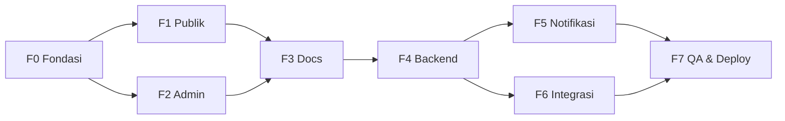
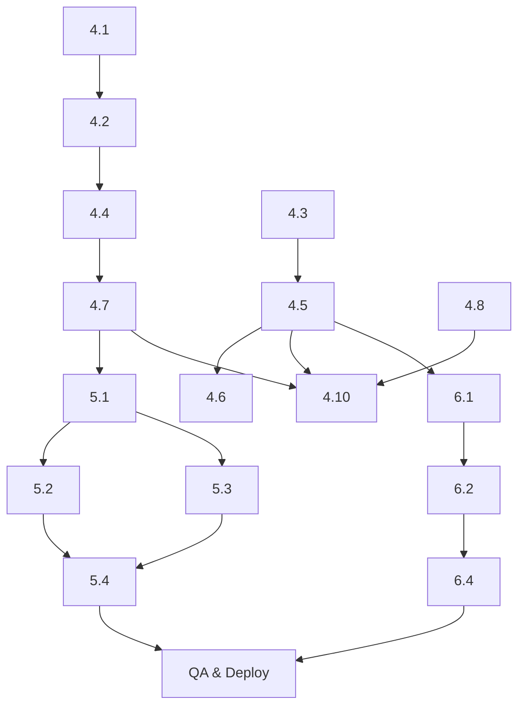

# SP Portal — Task Breakdown (WBS)

**Versi:** 1.0
**Proyek:** Soero Pramono Reunion Portal
**Tanggal:** Juni 2026
**Referensi:** PRD v3.1, SRS v1.1, SDD v1.0, UI/UX Flow v1.0

Work Breakdown Structure untuk SP Portal: fase, epik, tugas, status, estimasi, dependensi, dan kriteria penerimaan.

**Legenda status:** ✅ Selesai · 🔄 Sebagian · ⬜ Belum mulai
**Estimasi:** dalam hari-kerja (≈) untuk 1 developer.

---

## 1. Ringkasan Fase & Milestone

| Fase | Nama | Status | Estimasi |
|------|------|:---:|:---:|
| F0 | Fondasi & Setup | ✅ | 2 h |
| F1 | Frontend — Mock (Publik) | ✅ | 5 h |
| F2 | Frontend — Mock (Admin) | ✅ | 7 h |
| F3 | Dokumentasi (PRD/SRS/SDD/UI-UX/WBS) | ✅ | 2 h |
| F4 | Backend — FastAPI + PostgreSQL | ⬜ | 10 h |
| F5 | Integrasi Notifikasi (WA/Email) | ⬜ | 4 h |
| F6 | Integrasi Frontend ↔ Backend | ⬜ | 3 h |
| F7 | QA, Aksesibilitas, Deploy | ⬜ | 4 h |
| | **Total** | | **≈ 37 h** |



**Milestone:**
- **M1 — Demo mock jalan** (akhir F2): seluruh fitur dapat diperagakan tanpa backend. ✅
- **M2 — Spesifikasi lengkap** (akhir F3): PRD/SRS/SDD/UI-UX/WBS final. ✅
- **M3 — Backend siap** (akhir F4): API nyata lulus pengujian kontrak. ⬜
- **M4 — Produksi** (akhir F7): live, terpantau, ter-backup. ⬜

---

## 2. F0 — Fondasi & Setup ✅

| # | Tugas | Status | Est | Catatan |
|---|-------|:---:|:--:|--------|
| 0.1 | Inisialisasi Vite + React + TS | ✅ | 0.5 | |
| 0.2 | Konfigurasi Tailwind + design tokens (brand/sand) | ✅ | 0.5 | `tailwind.config.js`, `index.css` |
| 0.3 | UI primitives (`components/ui.tsx`) | ✅ | 1 | Button, Field, Card, Modal, dll |
| 0.4 | Router + layout publik/admin + auth context | ✅ | — | `App.tsx`, `auth.tsx` |

---

## 3. F1 — Frontend Publik (Mock) ✅

| # | Tugas | Status | Est | Acceptance |
|---|-------|:---:|:--:|-----------|
| 1.1 | Helpers `format.ts` (WA, Kode SP, SP Induk, tanggal) | ✅ | 1 | `isValidSpCode`, `spInduk`, `compareSpCode` lulus contoh PRD |
| 1.2 | Beranda — info acara + peta + status | ✅ | 1 | Tampil tanggal/lokasi; CTA sesuai status |
| 1.3 | Form Pendaftaran multi-peserta | ✅ | 1.5 | Tambah/hapus peserta; validasi; occupation & menginap opsional |
| 1.4 | Halaman Sukses — QR + daftar peserta | ✅ | 0.75 | `SP-XXXXXX` + QR + tautan kelola |
| 1.5 | Kelola Mandiri (token) | ✅ | 0.75 | Edit/tambah/hapus peserta; batalkan sesi |
| 1.6 | Datepicker Flowbite + umur terhitung | ✅ | 0.5 | `flowbite-datepicker`; `birth_date` ISO; umur dihitung admin; kolom `age` di CSV |
| 1.7 | RegionPicker pencarian kecamatan | ✅ | 0.75 | Autocomplete nasional (idn-area-data CSV); label "Provinsi, Kab/Kota, Kecamatan"; cache localStorage |

---

## 4. F2 — Frontend Admin (Mock) ✅

| # | Tugas | Status | Est | Acceptance |
|---|-------|:---:|:--:|-----------|
| 2.1 | Login + route guards | ✅ | 0.5 | `RequireAuth`/`RequireSuperAdmin` |
| 2.2 | Dashboard (daftar sesi, filter, ekspor) | ✅ | 1.5 | Filter SP Induk & status; cari; CSV |
| 2.3 | Detail Sesi (kelola peserta) | ✅ | 1.5 | Tambah/edit/hapus peserta; check-in; hapus sesi |
| 2.4 | Pengelompokan per SP Induk ⭐ | ✅ | 1 | Expand/collapse; ekspor per induk & semua |
| 2.5 | Statistik (kartu + grafik) | ✅ | 0.75 | Rekap per SP Induk + tren |
| 2.6 | Broadcast pengingat | ✅ | 0.75 | Segmen induk/status; channel; template |
| 2.7 | Log Notifikasi + retry | ✅ | 0.5 | Status + retry gagal |
| 2.8 | Check-in Hari-H | ✅ | 0.5 | Cari nama/Kode SP/kode; tandai hadir |
| 2.9 | Pengaturan Acara | ✅ | 0.25 | Edit acara; tanpa kuota |
| 2.10 | Akun Panitia (super admin) | ✅ | 0.25 | Tambah/nonaktif committee |

---

## 5. F3 — Dokumentasi ✅

| # | Tugas | Status | Catatan |
|---|-------|:---:|--------|
| 3.1 | PRD v3.1 | ✅ | `docs/SP_Portal_PRD_v3.1.md` |
| 3.2 | SRS v1.1 | ✅ | `docs/SP_Portal_SRS_v1.1.md` |
| 3.3 | SDD v1.0 (arsitektur/DB/API/backend) | ✅ | `docs/SP_Portal_SDD_v1.0.md` |
| 3.4 | UI/UX Flow v1.0 | ✅ | `docs/SP_Portal_UIUX_Flow_v1.0.md` |
| 3.5 | Task Breakdown v1.0 | ✅ | dokumen ini |

---

## 6. F4 — Backend (FastAPI + PostgreSQL) ⬜

**Dependensi:** F3 (SDD). **Acceptance keseluruhan:** semua endpoint §4 SDD mengembalikan shape identik `src/types.ts`; lulus pengujian kontrak.

| # | Tugas | Status | Est | Dependensi |
|---|-------|:---:|:--:|-----------|
| 4.1 | Skema DB + migrasi Alembic (5 tabel + enum + index) | ⬜ | 1 | SDD §3 |
| 4.2 | Model ORM + koneksi DB | ⬜ | 1 | 4.1 |
| 4.3 | Skema Pydantic (request/response) | ⬜ | 1 | SRS §3 |
| 4.4 | Auth: login, JWT, hash password, deps | ⬜ | 1 | 4.2 |
| 4.5 | Endpoint publik (event, status, registrations, token) | ⬜ | 1.5 | 4.3 |
| 4.6 | Service registrasi (sp_induk, status buka/tutup, transaksi) | ⬜ | 1 | 4.5 |
| 4.7 | Endpoint admin: sessions & participants CRUD + check-in | ⬜ | 1.5 | 4.4 |
| 4.8 | Reports: stats, grouping, sp-induk, export CSV | ⬜ | 1 | 4.2 |
| 4.9 | Validasi server: honeypot, format SP, normalisasi WA | ⬜ | 0.5 | 4.3 |
| 4.10 | Pengujian (pytest unit + kontrak API) | ⬜ | 1.5 | 4.5–4.8 |

---

## 7. F5 — Notifikasi (WA/Email) ⬜

| # | Tugas | Status | Est | Dependensi |
|---|-------|:---:|:--:|-----------|
| 5.1 | Layanan notifikasi + tulis `notification_logs` | ⬜ | 1 | 4.7 |
| 5.2 | Adapter WhatsApp gateway (Fonnte/Wablas) | ⬜ | 1 | 5.1 |
| 5.3 | Adapter Email (SMTP/transactional) | ⬜ | 1 | 5.1 |
| 5.4 | Broadcast + retry (BackgroundTasks/queue) | ⬜ | 1 | 5.2, 5.3 |

**Acceptance:** notifikasi fire-and-forget; kegagalan tidak membatalkan pendaftaran; semua percobaan ter-log; retry berfungsi.

---

## 8. F6 — Integrasi Frontend ↔ Backend ⬜

| # | Tugas | Status | Est | Catatan |
|---|-------|:---:|:--:|--------|
| 6.1 | Ganti body `src/lib/api.ts` → `fetch(VITE_API_URL…)` | ⬜ | 1.5 | Pertahankan signature & tipe |
| 6.2 | Header Authorization (JWT) + handling 401/423 | ⬜ | 0.5 | `RegistrationClosedError` dari 423 |
| 6.3 | `.env.production` (`VITE_API_URL`) + CORS backend | ⬜ | 0.5 | |
| 6.4 | Uji asap end-to-end (daftar → admin → check-in) | ⬜ | 0.5 | |

**Acceptance:** seluruh alur berjalan tanpa mengubah komponen UI.

---

## 9. F7 — QA, Aksesibilitas, Deploy ⬜

| # | Tugas | Status | Est |
|---|-------|:---:|:--:|
| 7.1 | Audit aksesibilitas (kontras, fokus, label, keyboard) | ⬜ | 1 |
| 7.2 | Uji lintas perangkat (375px–desktop) | ⬜ | 0.5 |
| 7.3 | Hardening keamanan (rate-limit, secret, headers) | ⬜ | 1 |
| 7.4 | Deploy backend (kontainer) + DB terkelola + HTTPS | ⬜ | 1 |
| 7.5 | Build & host frontend (CDN/Nginx) + domain | ⬜ | 0.5 |

**Acceptance (M4):** aplikasi live, terpantau (health-check + log), DB ter-backup harian.

---

## 10. Matriks Dependensi (ringkas)



---

## 11. Risiko Jadwal & Mitigasi
| Risiko | Dampak | Mitigasi |
|--------|--------|----------|
| Gateway WA berbayar/kuota | F5 tertunda | Mulai dengan dry-run + email; WA menyusul |
| Perbedaan shape API vs tipe FE | Rework integrasi | Pengujian kontrak (4.10) sebelum F6 |
| Data SP tidak rapi dari panitia | Pengelompokan meleset | Normalisasi + validasi server; tools koreksi admin |
| Waktu terbatas menjelang acara | Fitur terpotong | Prioritas: F4→F6 (inti) dulu, F5 broadcast belakangan |

---

## 12. Definition of Done (DoD)
Sebuah tugas dianggap selesai bila: kode ter-review, `npm run build` / `pytest` hijau, sesuai PRD/SRS, aksesibel (untuk UI), teks Bahasa Indonesia, dan terdokumentasi bila mengubah kontrak.
```
