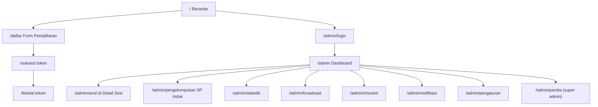
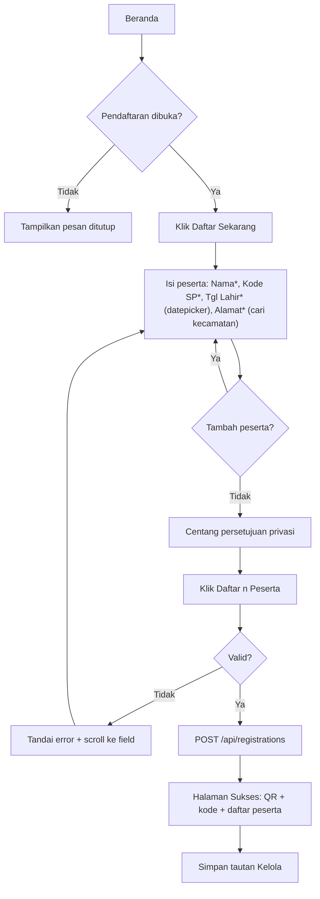
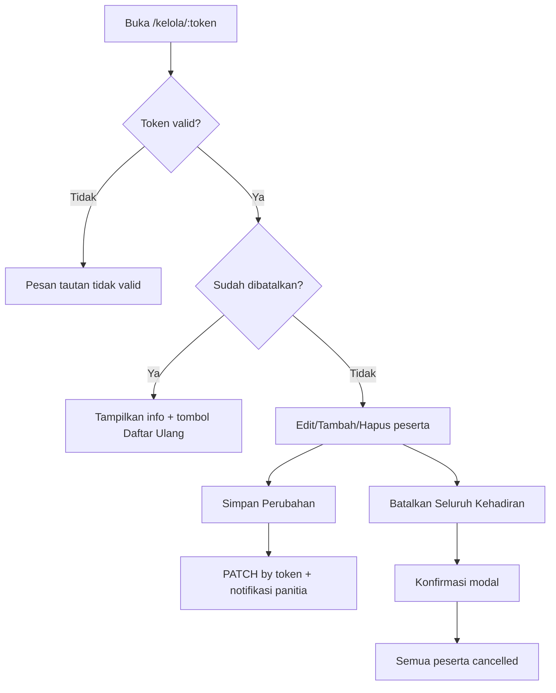
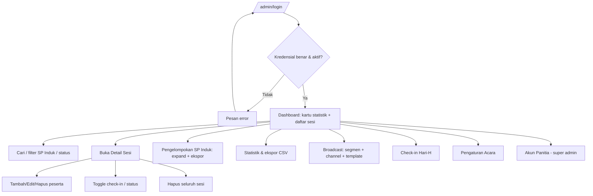
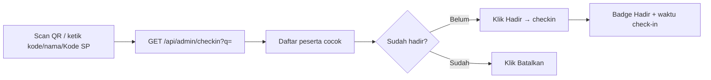

# SP Portal — UI/UX Flow & Design

**Versi:** 1.1
**Proyek:** Soero Pramono Reunion Portal
**Tanggal:** Juni 2026
**Referensi:** PRD v3.1, SRS v1.1, SDD v1.0

> **Perubahan v1.0 → v1.1:** Tanggal lahir memakai **datepicker** (Flowbite, lokal Bahasa Indonesia); **umur dihitung otomatis** (tampil di sisi panitia, tidak diinput pengguna); alamat domisili memakai **satu kotak pencarian kecamatan** (autocomplete) menggantikan teks bebas.

Dokumen ini menentukan tampilan (design system) dan alur pengguna (user flow) SP Portal — area publik (peserta) dan area panitia (admin).

---

## 1. Prinsip Desain

1. **Mobile-first** — dirancang untuk layar 375px lebih dulu, lalu ditingkatkan ke desktop.
2. **Ramah lansia** — teks besar, kontras tinggi, label jelas, target sentuh ≥ 44px, satu kolom di HP.
3. **Bahasa Indonesia** sepenuhnya; format tanggal `id-ID`.
4. **Friksi minimal** — langsung input peserta; field wajib sesedikit mungkin (Nama, Kode SP, Tgl Lahir, Alamat).
5. **Umpan balik jelas** — setiap aksi punya state loading, sukses, dan error yang terlihat.
6. **Konsisten** — satu set komponen (`src/components/ui.tsx`) dipakai di semua halaman.

---

## 2. Design Tokens

### 2.1 Warna (Tailwind `theme.extend`)
| Token | Hex | Penggunaan |
|-------|-----|-----------|
| `brand-50` | `#f0fdf4` | Latar lembut, kartu sukses |
| `brand-100` | `#dcfce7` | Badge, lingkaran nomor peserta |
| `brand-500` | `#22c55e` | Bar chart, aksen |
| `brand-600` | `#16a34a` | **Tombol utama**, link aktif |
| `brand-700` | `#15803d` | Hover, judul angka, teks aksen |
| `sand-50` | `#faf8f3` | **Latar halaman (body)** |
| `slate-800/900` | — | Teks utama |
| `slate-400/500` | — | Teks sekunder, hint |
| `red-600` | — | Bahaya/batal, error |
| `amber` | — | Peringatan, status check-in |
| `blue` | — | Info, badge check-in |

### 2.2 Tipografi
- Font: **Inter** (fallback system-ui, Helvetica, Arial).
- Skala: Judul halaman `text-2xl`→`text-3xl` `font-extrabold`; subjudul `text-lg font-bold`; teks `text-base`; hint `text-xs`/`text-sm`.
- Input/tombol minimal `text-base` agar terbaca lansia.

### 2.3 Bentuk & Spasi
- Sudut: input `rounded-xl`, kartu `rounded-2xl`, badge `rounded-full`.
- Kartu: `border border-slate-200 bg-white shadow-sm p-5 sm:p-6`.
- Container publik: `max-w-3xl`; admin: `max-w-7xl` dengan sidebar.
- Fokus: `ring-2 ring-brand-500 ring-offset-2` (aksesibilitas keyboard).

### 2.4 Inventaris Komponen (`ui.tsx`)
`Button` (primary/secondary/outline/ghost/danger · sm/md/lg · loading) · `Field` (label+hint+error) · `Input` · `Textarea` · `Select` · `Card` · `Badge` (slate/green/red/amber/blue) · `Alert` (info/success/error/warning) · `Modal` (bottom-sheet di HP) · `Spinner` · `PageLoader` · `StatCard` · `Logo`.

**Komponen khusus form:**
- **`DatePicker`** (`components/DatePicker.tsx`) — pembungkus *Flowbite datepicker*, kalender Bahasa Indonesia, nilai ISO `YYYY-MM-DD`, `max` = hari ini. Dipakai untuk Tanggal Lahir.
- **`RegionPicker`** (`components/RegionPicker.tsx`) — autocomplete alamat domisili: ketik nama kecamatan/kota → daftar berlabel "Provinsi, Kabupaten/Kota, Kecamatan" (data idn-area-data, dimuat sekali & di-cache di localStorage).

---

## 3. Peta Navigasi (Site Map)



---

## 4. Inventaris Layar

| Area | Layar | Tujuan |
|------|-------|--------|
| Publik | Beranda | Info acara, peta, status, CTA daftar |
| Publik | Form Pendaftaran | Input 1..n peserta + persetujuan |
| Publik | Sukses | Kode/QR check-in + ringkasan peserta + tautan kelola |
| Publik | Kelola Mandiri | Edit/tambah/hapus peserta, batalkan |
| Admin | Login | Autentikasi panitia |
| Admin | Dashboard | Daftar sesi + filter + ekspor |
| Admin | Detail Sesi | Kelola peserta dalam satu sesi |
| Admin | Pengelompokan SP Induk | Rekap peserta per induk + ekspor |
| Admin | Statistik | Ringkasan + grafik |
| Admin | Broadcast | Kirim pengingat massal |
| Admin | Log Notifikasi | Riwayat + retry |
| Admin | Check-in | Pencarian + tandai hadir |
| Admin | Pengaturan Acara | Konfigurasi acara |
| Admin | Akun Panitia | Kelola committee |

---

## 5. Alur Pengguna — Publik

### 5.1 Pendaftaran


### 5.2 Kelola Mandiri


---

## 6. Alur Pengguna — Admin



### 6.1 Check-in Hari-H


---

## 7. Tata Letak Layar Kunci (Wireframe)

### 7.1 Form Pendaftaran (mobile)
```
┌───────────────────────────────┐
│ Formulir Pendaftaran          │
│ Masukkan data peserta…        │
├───────────────────────────────┤
│ ⓘ Tentang Kode SP             │
│   SP4 · SP4A · SP4.1 · …      │
├───────────────────────────────┤
│ (1) Peserta 1            ✕     │
│  Nama Lengkap *  [_________]  │
│  Kode SP *       [SP4.1.3 ]   │
│  Tgl Lahir *  [📅 pilih tgl]  │
│  Alamat *  [🔍 cari kecamatan]│
│  Pekerjaan(ops) Menginap(ops) │
│  Email(ops)     WA(ops)       │
├───────────────────────────────┤
│ [ + Tambah Peserta ]          │
│ ☑ Saya menyetujui… (privasi)  │
│ [   Daftar 1 Peserta   ]      │
└───────────────────────────────┘
```

### 7.2 Dashboard Admin (desktop)
```
┌── Sidebar ──┬───────────────────────────────────────────┐
│ Dashboard   │ [Sesi] [Peserta] [Check-in] [Batal]       │
│ Pengelompok.│ ┌ Filter: cari · SP Induk · status ┐       │
│ Statistik   │ │ Perwakilan │Peserta│Induk│Kontak│…│Aksi││
│ Broadcast   │ │ Yoso Prmn  │ 2/2   │ SP4 │ 62…  │…│Det.││
│ Check-in    │ └──────────────────────────────────────┘  │
│ …           │                                           │
└─────────────┴───────────────────────────────────────────┘
```

### 7.3 Pengelompokan SP Induk
```
▶ SP1  (2 orang)                                   [⬇ CSV]
▼ SP4  (5 orang)                                   [⬇ CSV]
   Nama        | Kode SP  | Alamat | Umur/Tgl | Pek. | Menginap | Email | WA
   Yoso Pramono| SP4      | Yogya  | 5/5/58   | Guru | Hotel    | -     | 62…
   …
```

---

## 8. State Komponen (wajib ditangani tiap layar)

| State | Pola UI |
|-------|---------|
| **Loading** | `PageLoader` (spinner + "Memuat…") atau tombol `loading` |
| **Empty** | Kartu netral: "Tidak ada … yang cocok" / "Belum ada data" |
| **Error (form)** | `Field.error` merah + `aria-invalid` + auto-scroll ke field pertama |
| **Error (server)** | `Alert variant="error"` di atas form |
| **Sukses** | `Alert variant="success"` / redirect ke halaman Sukses |
| **Konfirmasi destruktif** | `Modal` (bottom-sheet di HP) dengan tombol Batal + Bahaya |

---

## 9. Aksesibilitas & Responsif

- **Kontras** memenuhi WCAG AA; warna tidak jadi satu-satunya penanda (selalu ada teks/ikon).
- **Keyboard**: fokus terlihat (`ring`), urutan tab logis, `Esc` menutup modal.
- **Form**: tiap input punya `<label htmlFor>`, `id`, `aria-invalid`, `autoComplete`, `inputMode="numeric"` untuk nomor.
- **Breakpoint**: `< lg` → kartu/satu kolom & drawer nav; `≥ lg` → tabel & sidebar tetap. Tabel lebar (Pengelompokan) → `overflow-x-auto`.
- **Bahasa & angka**: `toLocaleString('id-ID')`; istilah keluarga ("Kode SP", "SP Induk", "Pendaftaran").
- **Target sentuh** ≥ 44px; tombol utama `size="lg"` `fullWidth` di HP.

---

## 10. Ringkasan Keputusan UX v3.1
- Hilangkan bagian "Data Pendata" → form langsung ke peserta (lebih cepat & sederhana).
- Pekerjaan & Menginap **opsional** (hint "Opsional", tanpa tanda `*`).
- Identitas sesi di admin diwakili **peserta pertama** (kolom "Perwakilan").
- Satu **persetujuan privasi** untuk seluruh pendaftaran.
- Tanpa kuota & tanpa pencegahan duplikat (kontrol via tools admin).
- **Tanggal lahir** via datepicker (Flowbite, lokal id); **umur dihitung otomatis** dan hanya tampil ke panitia (Detail Sesi, Pengelompokan, kolom `age` pada CSV).
- **Alamat domisili** = satu kotak pencarian kecamatan se-Indonesia (ketik mis. "cih" → hasil bertingkat hanya pada label opsi); tersimpan sebagai "Provinsi, Kabupaten/Kota, Kecamatan".
```
